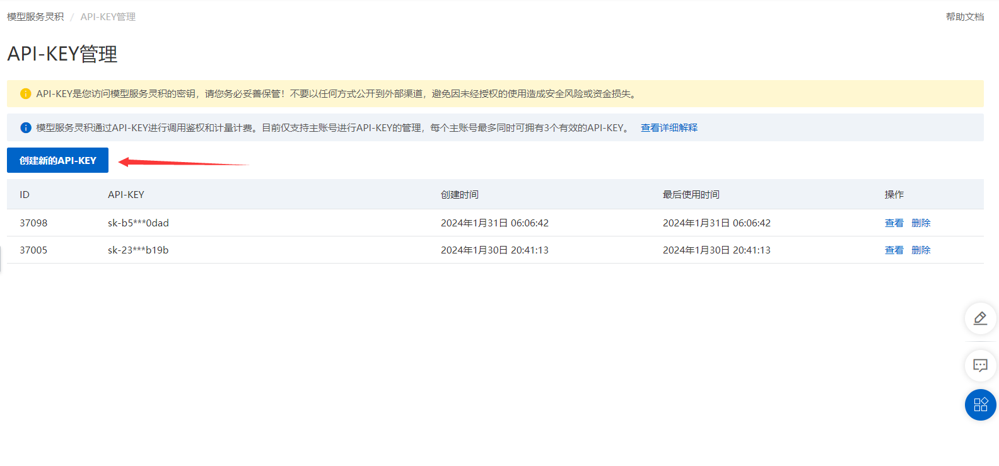
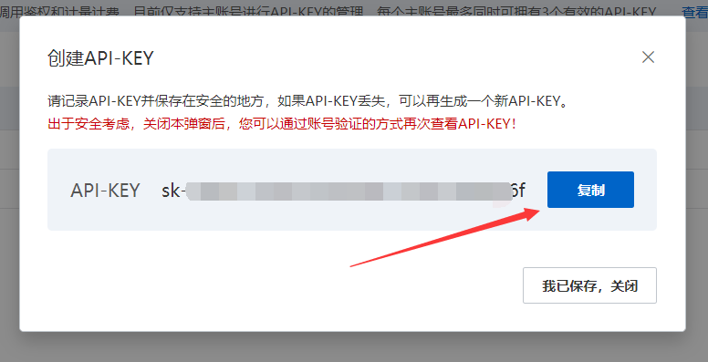
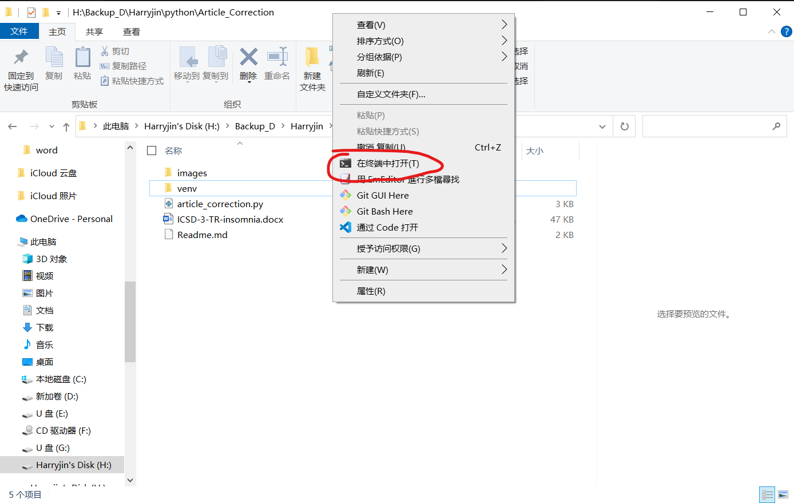

# 使用方法
## 开通DashScope服务
请查阅[官方参考文档](https://help.aliyun.com/zh/dashscope/developer-reference/activate-dashscope-and-create-an-api-key?spm=a2c4g.11186623.0.i1)

---

## 添加API-KEY
1. 访问 [DashScope控制台](https://dashscope.console.aliyun.com/apiKey)
2. 点击“创建新的API-KEY”
   
3. 点击蓝色的“复制”按钮  
   
4. 将其复制并替换[主程序](article_correction.py)中第19行的 *YOUR-API-KEY* （切记不要删除双引号）

---

## 运行主程序
> 所有python可执行文件已经集成于venv目录下，无需另外下载  

1. 右键单击本文件夹空白处，选择在 终端 打开
   
2. 在命令行输入下列代码（纠正拼写）  
   ```console
   venv\Scripts\python.exe article_correction.py --input input.docx
   ```
   翻译用下列代码：
   ```console
   venv\Scripts\python.exe article_correction.py --input input.docx --method translate
   ```  
   如果有其他名字的文件，可以将input.docx改成对应文件名即可（一定要带后缀名）
4. 输出的文件将会命名为 “原文件名_after.docx”

# To-do list

## 必要功能
- [x] 通过API接口访问大模型
- [x] 将大模型的输出转换为string格式
- [x] 读取docx文件
- [x] 循环读取docx段落
- [x] 将处理好的段落保存至新的docx文件
  
## 非必要功能
- [x] 添加处理进度条
